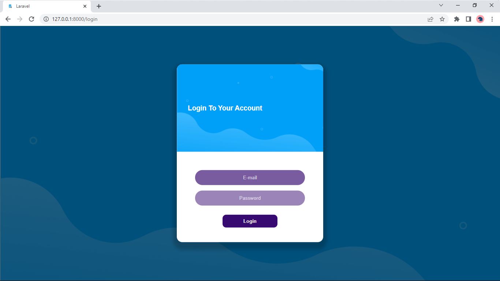

# Laravel Laundry

Projek ini merupakan sebuah aplikasi laundry berbasis web sederhana dengan menggunakan framework php laravel. Projek ini merupakan projek akhir di kelas XII 

## Flowchart

## Database

`Database User`

***

`Database Member`

***

`Database Paket`

***

`Database Transaksi`

***

## Preview

`landing page`

***

`login`

***

`dashboard`

***

`CRUD User(Pegawai)`

***

`CRUD Member(Pelanggan)`

***

`CRUD Paket`

***

`CRUD Transaksi`

***

`Profil`

***

`Logout`

